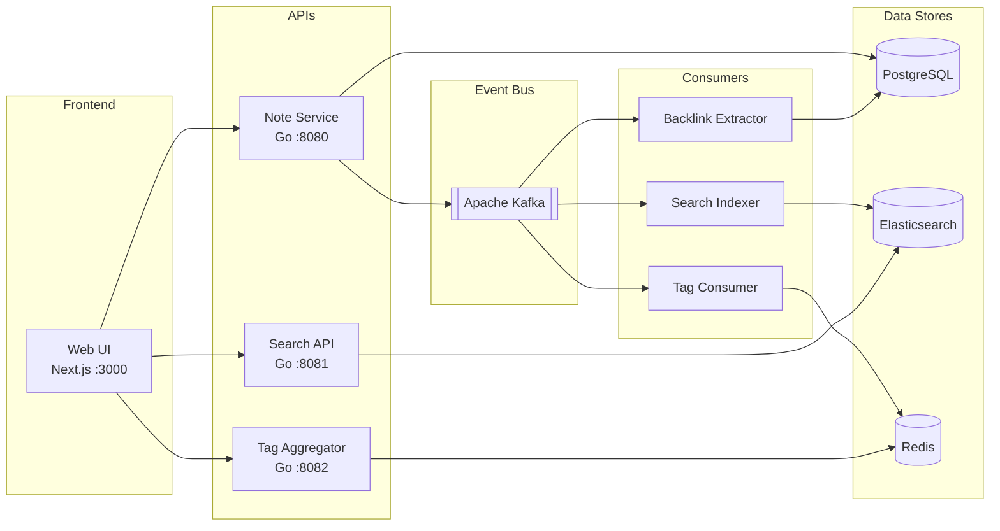

# Knowledge Base — Event-Driven Microservices

A team knowledge base built with an event-driven microservices architecture. Teams can organize markdown documentation into collections, search across everything with full-text search, and automatically discover connections between documents through wiki-links.

This project is a learning exercise — built to gain hands-on experience with Go, Kafka, Elasticsearch, Docker, and distributed systems design by building a real application end-to-end.

## Features

- **Collections** — Organize notes into user-created groups 
- **Full-text search** — Powered by Elasticsearch with relevance scoring and highlighting
- **Wiki-links** — Write `[[Note Title]]` to link between notes; backlinks detected automatically
- **Tag system** — Real-time tag aggregation with instant tag cloud
- **Markdown rendering** — Code syntax highlighting, tables, GFM support
- **File import** — Drag-and-drop .md files with bulk tagging and collection assignment
- **Event-driven** — Services communicate asynchronously via Kafka

## Architecture



Six services communicating via Kafka events:

| Service | Type | Responsibility |
|---------|------|----------------|
| **Note Service** | HTTP API | CRUD for notes and collections, publishes Kafka events |
| **Search Indexer** | Kafka consumer | Indexes note content into Elasticsearch |
| **Search API** | HTTP API | Full-text search with tag filtering and date ranges |
| **Tag Aggregator** | Kafka consumer + HTTP | Maintains tag counts in Redis sorted sets |
| **Backlink Extractor** | Kafka consumer | Parses `[[wiki-links]]`, builds connection graph |
| **Web UI** | Next.js app | Frontend with markdown viewer, search, file import, collections |

## Tech Stack

| Component | Technology |
|-----------|-----------|
| Backend | Go 1.22 (standard library `net/http`) |
| Frontend | Next.js 14, TypeScript, Tailwind CSS |
| Database | PostgreSQL 16 |
| Search | Elasticsearch 8.13 |
| Messaging | Apache Kafka |
| Cache/Counters | Redis 7 (sorted sets) |
| Containers | Docker, Docker Compose |
| Deployment | AWS EC2 |

## Quick Start

```bash
# Clone
git clone https://github.com/escaleloisa/knowledge-base.git
cd knowledge-base

# Configure
cp .env.example .env
# Edit .env with your settings

# Run everything
make docker-up

# Access
open http://localhost:3000
```

Or without make:

```bash
docker compose up -d --build
```

## API Endpoints

### Note Service (port 8080)

| Method | Path | Description |
|--------|------|-------------|
| POST | `/api/notes` | Create a note |
| GET | `/api/notes` | List notes (paginated) |
| GET | `/api/notes/:id` | Get a note |
| PUT | `/api/notes/:id` | Update a note |
| DELETE | `/api/notes/:id` | Delete a note |
| GET | `/api/notes/:id/backlinks` | Get notes linking to this note |
| POST | `/api/collections` | Create a collection |
| GET | `/api/collections` | List collections with note counts |
| GET | `/api/collections/:id` | Get a collection |
| PUT | `/api/collections/:id` | Update a collection |
| DELETE | `/api/collections/:id` | Delete a collection |
| GET | `/api/collections/:id/notes` | List notes in a collection |
| POST | `/api/collections/:id/notes` | Add notes to a collection |
| DELETE | `/api/collections/:id/notes/:noteId` | Remove note from collection |

### Search API (port 8081)

| Method | Path | Description |
|--------|------|-------------|
| GET | `/api/search?q=&tags=&from=&to=` | Full-text search with filters |

### Tag Aggregator (port 8082)

| Method | Path | Description |
|--------|------|-------------|
| GET | `/api/tags` | All tags sorted by count |

## Project Structure

```
├── cmd/                    # Service entrypoints (main.go per service)
├── internal/               # Service-specific business logic
│   ├── note-service/       #   Clean architecture layers:
│   │   ├── handler/        #     HTTP request/response
│   │   ├── service/        #     Business logic + Kafka events
│   │   ├── repository/     #     Database queries
│   │   └── routes/         #     Route registration
│   ├── search-api/
│   ├── search-indexer/
│   ├── tag-aggregator/
│   └── backlink-extractor/
├── pkg/                    # Shared packages
│   ├── config/             #   Environment config
│   ├── kafka/              #   Event types, reader/writer
│   ├── middleware/         #   CORS middleware
│   ├── models/             #   Note, Collection structs
│   └── response/           #   JSON response helpers
├── web/                    # Next.js frontend
│   └── src/
│       ├── app/            #   Pages (App Router)
│       ├── components/     #   Sidebar, MarkdownViewer, etc.
│       └── lib/            #   API client
├── deployments/docker/     # Dockerfiles per service
├── scripts/                # DB init/migration SQL
├── docs/                   # API reference, database schema
├── specs/                  # Design docs and guides
├── test-data/              # Sample .md files for testing
└── docker-compose.yml      # Full stack orchestration
```

## Design Decisions

- **Event-driven over synchronous** — Adding features means adding Kafka consumers, not modifying existing services. If Elasticsearch goes down, note creation still works.
- **Each data store serves a purpose** — Postgres for structured data, Elasticsearch for text search, Redis for counters. Each tool is optimized for its access pattern.
- **Go standard library for HTTP** — No heavy frameworks. Uses Go 1.22's built-in routing (`net/http` with method + path patterns). Keeps dependencies minimal.
- **Microservices for learning** — In production, this scale could be a monolith. The microservices architecture was chosen to practice containerization (each service has its own Dockerfile), multi-service orchestration with Docker Compose, and event-driven communication patterns.

## Documentation

- [API Reference](docs/API.md) — Full endpoint documentation with request/response examples
- [Database Schema](docs/DATABASE.md) — ER diagram, table definitions, indexes
- [Deployment Guide](specs/DEPLOYMENT.md) — AWS EC2 setup instructions
