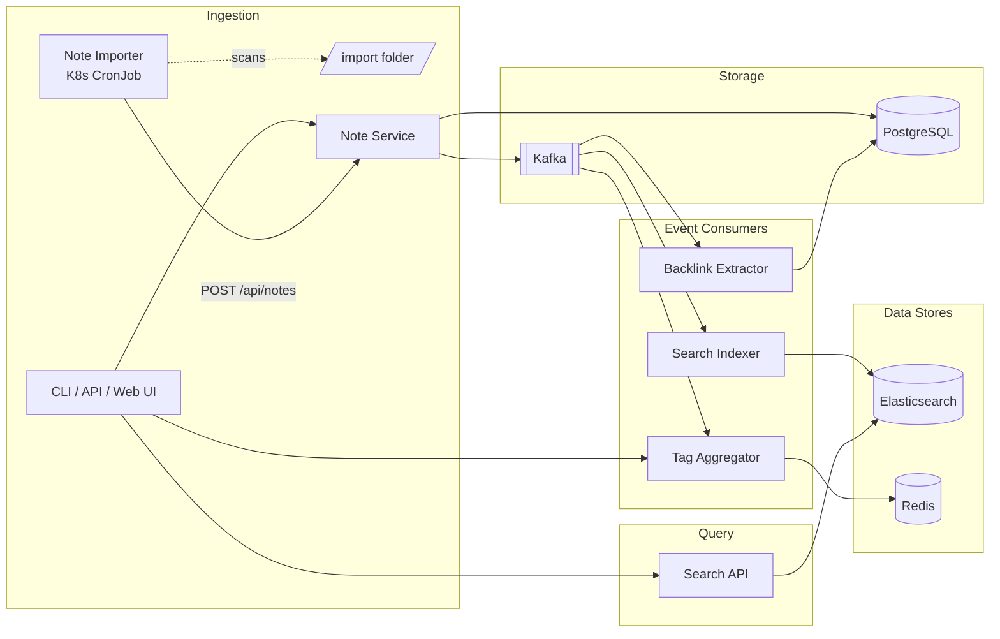

# Self-Hosted Knowledge Base — Project Spec

## Overview

A self-hosted, API-first knowledge base for storing markdown notes with full-text search, backlinks, and tag management. Built with an event-driven microservices architecture using Go, Kafka, Elasticsearch, and Kubernetes.

## Goals

- Build a useful personal knowledge base with powerful search
- Learn containerization (Docker), orchestration (Kubernetes), and event-driven architecture (Kafka)
- Practice designing and operating a microservices system end-to-end
- Learn different K8s workload types: Deployments, CronJobs

## Architecture



## Services

| # | Service | Type | Trigger | Responsibility | Storage |
|---|---------|------|---------|---------------|---------|
| 1 | Note Service | Deployment (always running) | HTTP requests | CRUD notes (markdown), publish events to Kafka | Postgres |
| 2 | Search Indexer | Deployment (always running) | Kafka consumer | Consume events, index note content for full-text search | Elasticsearch |
| 3 | Search API | Deployment (always running) | HTTP requests | Query Elasticsearch — full-text search, tag filtering, date range | Elasticsearch |
| 4 | Tag Aggregator | Deployment (always running) | Kafka consumer | Consume events, maintain tag counts and relationships | Redis |
| 5 | Backlink Extractor | Deployment (always running) | Kafka consumer | Consume events, detect `[[note-title]]` links between notes | Postgres |
| 6 | Note Importer | CronJob (runs on schedule) | Scheduled / file watcher | Scan /import folder for .md files, call Note Service API to create notes | — |

### Trigger patterns covered

| Pattern | Services using it |
|---------|-------------------|
| HTTP server (always listening) | Note Service, Search API |
| Kafka consumer (event-driven) | Search Indexer, Tag Aggregator, Backlink Extractor |
| CronJob (scheduled) | Note Importer |

## Data Models

### notes (PostgreSQL)

#### Schema

| Column | Data Type | Mandatory | Description |
|--------|:---------:|:---------:|-------------|
| id | UUID | Y | Unique identifier, auto-generated |
| title | VARCHAR(255) | Y | Note title |
| content | TEXT | Y | Note body in markdown |
| tags | TEXT[] | N | Array of tag labels. Default: empty |
| created_at | TIMESTAMPTZ | Y | Creation timestamp. Default: NOW() |
| updated_at | TIMESTAMPTZ | Y | Last modified timestamp. Default: NOW() |

#### Indexes

| Name | Type | Column(s) | Description |
|------|------|-----------|-------------|
| idx_notes_tags | GIN | tags | Fast tag filtering |
| idx_notes_created_at | B-tree | created_at DESC | Fast chronological listing |

#### Query Patterns

```go
// List notes (paginated, newest first)
SELECT * FROM notes ORDER BY created_at DESC LIMIT $1 OFFSET $2

// Search notes by keyword (temporary, replaced by Elasticsearch in Phase 2)
SELECT * FROM notes WHERE title ILIKE '%keyword%' OR content ILIKE '%keyword%'

// Filter notes by tag
SELECT * FROM notes WHERE $1 = ANY(tags)
```

### backlinks (PostgreSQL)

#### Schema

| Column | Data Type | Mandatory | Description |
|--------|:---------:|:---------:|-------------|
| source_note_id | UUID | Y | FK → notes(id) ON DELETE CASCADE. The note containing the `[[link]]` |
| target_note_id | UUID | Y | FK → notes(id) ON DELETE CASCADE. The note being referenced |
| created_at | TIMESTAMPTZ | Y | When the link was detected. Default: NOW() |

Primary key: (source_note_id, target_note_id)

#### Indexes

| Name | Type | Column(s) | Description |
|------|------|-----------|-------------|
| idx_backlinks_target | B-tree | target_note_id | Fast "what links to this note?" query |

#### Query Patterns

```go
// Get all notes that link TO a specific note (backlinks)
SELECT n.* FROM notes n
JOIN backlinks b ON b.source_note_id = n.id
WHERE b.target_note_id = $1

// Get all notes that a specific note links TO (outgoing links)
SELECT n.* FROM notes n
JOIN backlinks b ON b.target_note_id = n.id
WHERE b.source_note_id = $1
```

### Elasticsearch Document

#### Schema

| Field | Data Type | Mandatory | Description |
|-------|:---------:|:---------:|-------------|
| id | keyword | Y | Note UUID, mapped from Postgres |
| title | text | Y | Note title, analyzed for full-text search |
| content | text | Y | Note body in markdown, analyzed for full-text search |
| tags | keyword[] | Y | Array of tag labels, used for exact-match filtering |
| created_at | date | Y | Creation timestamp |
| updated_at | date | Y | Last modified timestamp |

#### Query Patterns

```go
// Full-text search with optional tag filter and date range
GET /notes/_search
{
  "query": {
    "bool": {
      "must": [{ "multi_match": { "query": "keyword", "fields": ["title^2", "content"] }}],
      "filter": [
        { "terms": { "tags": ["go"] }},
        { "range": { "created_at": { "gte": "2026-01-01" }}}
      ]
    }
  },
  "highlight": { "fields": { "content": {} }}
}
```

### Kafka Events

#### Schema

| Event | Payload |
|-------|---------|
| note.created | `{ note_id, title, content, tags, created_at }` |
| note.updated | `{ note_id, title, content, tags, updated_at }` |
| note.deleted | `{ note_id }` |

Topic: `notes`

### Redis (Tag Aggregator)

#### Schema

| Key | Data Type | Description |
|-----|:---------:|-------------|
| `tag:{name}` | string | Note count for a specific tag |
| `tags:all` | sorted set | All tags, scored by note count |

#### Query Patterns

```go
// Get all tags sorted by count (descending)
ZREVRANGE tags:all 0 -1 WITHSCORES

// Get count for a specific tag
GET tag:docker
```

## API Endpoints

### Note Service

| Method | Path | Description |
|--------|------|-------------|
| POST | /api/notes | Create a note |
| GET | /api/notes/:id | Get a note by ID |
| PUT | /api/notes/:id | Update a note |
| DELETE | /api/notes/:id | Delete a note |
| GET | /api/notes | List notes (paginated) |
| GET | /api/notes/:id/backlinks | Get notes that link to this note |

### Search API

| Method | Path | Description |
|--------|------|-------------|
| GET | /api/search?q=&tags=&from=&to= | Full-text search with filters |

### Tag Aggregator

| Method | Path | Description |
|--------|------|-------------|
| GET | /api/tags | List all tags with counts |

## Tech Stack

| Component | Technology |
|-----------|-----------|
| Language | Go |
| Database | PostgreSQL |
| Search | Elasticsearch |
| Messaging | Apache Kafka |
| Cache | Redis |
| Containers | Docker, docker-compose |
| Orchestration | Kubernetes (kind) |
| Observability | Prometheus, Grafana |

## Phased Implementation

### Phase 1 — Core Services + Docker (Week 1–2)

- Note Service: full CRUD with Postgres
- Dockerize with multi-stage Go builds
- docker-compose: Note Service + Postgres
- Basic list/get with Postgres `ILIKE` search (temporary)

### Phase 2 — Kafka + Event-Driven Consumers (Week 3–4)

- Add Kafka, Elasticsearch, Redis to docker-compose
- Note Service publishes events to Kafka on create/update/delete
- Search Indexer: consumes events, indexes into Elasticsearch
- Tag Aggregator: consumes events, maintains counts in Redis
- Backlink Extractor: parses `[[references]]`, stores link graph
- Search API: full-text search with highlighting and filtering
- Note Importer: scans /import folder, calls Note Service API
- Re-index command: replay events to rebuild search index

### Phase 3 — Kubernetes (Week 5–6)

- Local cluster with `kind`
- K8s manifests: Deployments, Services, ConfigMaps, Secrets
- Note Importer as K8s CronJob
- Kafka (Strimzi), Elasticsearch, Redis, Postgres via Helm charts
- Liveness/readiness probes on all services
- Horizontal scaling of consumer services

### Phase 4 — Observability + Hardening (Week 7–8)

- Instrument Go services with Prometheus metrics
- Deploy Prometheus + Grafana
- Structured logging (slog)
- Dead letter topic for failed events
- Optional: simple web UI or CLI client

## Repo Structure

```
knowledge-base/
├── SPEC.md
├── Makefile
├── docker-compose.yml
├── go.mod
├── cmd/
│   ├── note-service/main.go
│   ├── search-indexer/main.go
│   ├── search-api/main.go
│   ├── tag-aggregator/main.go
│   ├── backlink-extractor/main.go
│   └── note-importer/main.go
├── internal/
│   ├── note-service/
│   │   ├── handler/
│   │   ├── service/
│   │   ├── repository/
│   │   └── routes/
│   ├── search-indexer/
│   ├── search-api/
│   ├── tag-aggregator/
│   ├── backlink-extractor/
│   └── note-importer/
├── pkg/
│   ├── config/
│   ├── models/
│   ├── response/
│   └── kafka/
├── deployments/
│   ├── docker/
│   │   ├── note-service/Dockerfile
│   │   ├── search-indexer/Dockerfile
│   │   └── ...
│   └── k8s/
│       ├── note-service/
│       ├── search-indexer/
│       └── infrastructure/
└── scripts/
    └── init.sql
```

## Non-Goals (for now)

- Authentication / multi-user support
- Rich text editor / WYSIWYG
- Mobile app
- Cloud deployment
