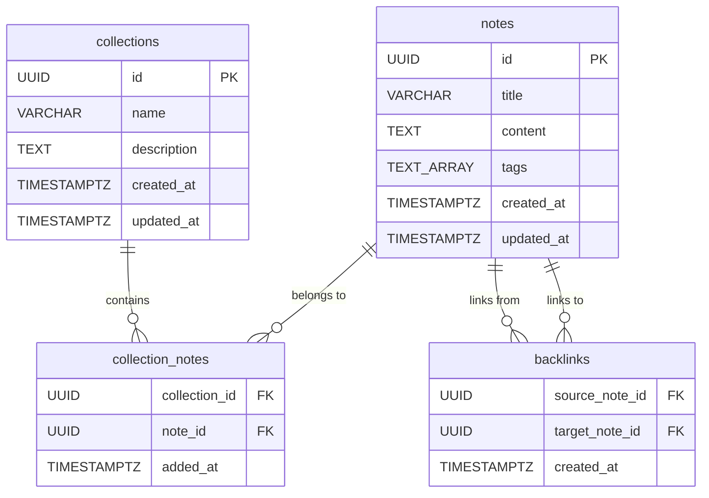

# Database Schema

PostgreSQL 16 — all tables live in a single `knowledgebase` database.

## Entity Relationship Diagram

## Tables

### notes

Primary storage for all knowledge base content.

| Column | Type | Nullable | Default | Description |
|--------|------|:--------:|---------|-------------|
| id | UUID | No | `uuid_generate_v4()` | Primary key |
| title | VARCHAR(255) | No | — | Note title |
| content | TEXT | No | — | Markdown body |
| tags | TEXT[] | Yes | `'{}'` | Array of tag labels |
| created_at | TIMESTAMPTZ | No | `NOW()` | When created |
| updated_at | TIMESTAMPTZ | No | `NOW()` | Last modified |

**Indexes:**
- `idx_notes_tags` — GIN index on `tags` for fast tag filtering
- `idx_notes_created_at` — B-tree on `created_at DESC` for chronological listing

---

### collections

User-created groups for organizing notes.

| Column | Type | Nullable | Default | Description |
|--------|------|:--------:|---------|-------------|
| id | UUID | No | `uuid_generate_v4()` | Primary key |
| name | VARCHAR(255) | No | — | Collection name |
| description | TEXT | Yes | `''` | Optional description |
| created_at | TIMESTAMPTZ | No | `NOW()` | When created |
| updated_at | TIMESTAMPTZ | No | `NOW()` | Last modified |

**Indexes:**
- `idx_collections_name` — B-tree on `name`
- `idx_collections_created_at` — B-tree on `created_at DESC`

---

### collection_notes

Join table — many-to-many relationship between collections and notes.

| Column | Type | Nullable | Default | Description |
|--------|------|:--------:|---------|-------------|
| collection_id | UUID | No | — | FK → collections(id) ON DELETE CASCADE |
| note_id | UUID | No | — | FK → notes(id) ON DELETE CASCADE |
| added_at | TIMESTAMPTZ | No | `NOW()` | When note was added to collection |

**Primary key:** `(collection_id, note_id)`

**Indexes:**
- `idx_collection_notes_note` — B-tree on `note_id` (fast "which collections is this note in?")

**Behavior:**
- Deleting a collection removes all its relationships (notes survive)
- Deleting a note removes it from all collections

---

### backlinks

Connection graph — tracks which notes reference other notes via `[[wiki-links]]`.

| Column | Type | Nullable | Default | Description |
|--------|------|:--------:|---------|-------------|
| source_note_id | UUID | No | — | FK → notes(id) ON DELETE CASCADE. The note containing the link |
| target_note_id | UUID | No | — | FK → notes(id) ON DELETE CASCADE. The note being linked to |
| created_at | TIMESTAMPTZ | No | `NOW()` | When the link was detected |

**Primary key:** `(source_note_id, target_note_id)`

**Indexes:**
- `idx_backlinks_target` — B-tree on `target_note_id` (fast "what links to this note?")

**Behavior:**
- Populated automatically by the Backlink Extractor (Kafka consumer)
- Rebuilt on every note update (deletes old links, re-extracts)
- Case-insensitive matching: `[[docker-basics]]` finds note titled "Docker Basics"

---

## Other Data Stores

### Elasticsearch Index: `notes`

| Field | Type | Description |
|-------|------|-------------|
| id | keyword | Note UUID |
| title | text (boost: 2) | Analyzed for search, weighted higher |
| content | text | Analyzed for full-text search |
| tags | keyword[] | Exact-match filtering |
| created_at | date | Date range filtering |
| updated_at | date | Last modified |

### Redis (Tag Aggregator)

| Key | Type | Description |
|-----|------|-------------|
| `tags:all` | Sorted Set | All tags scored by note count |
| `tag:{name}` | String | Individual count per tag |

Query: `ZREVRANGE tags:all 0 -1 WITHSCORES` → all tags ranked by popularity.
